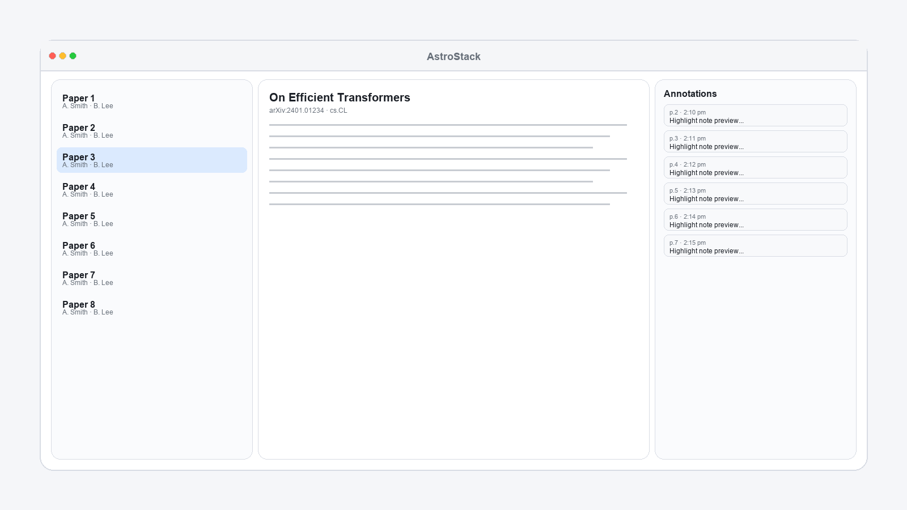
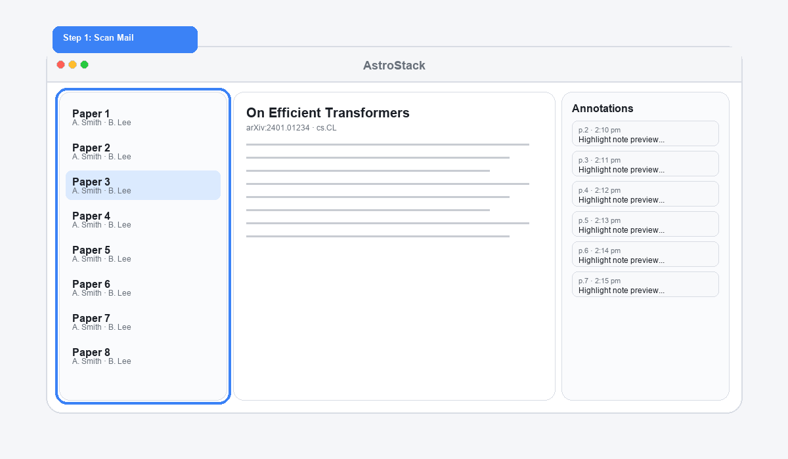
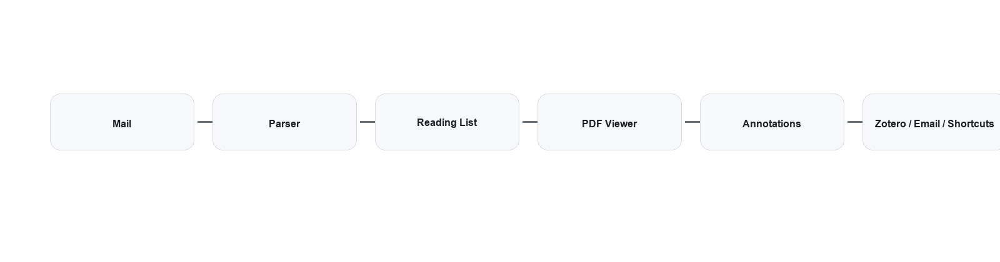
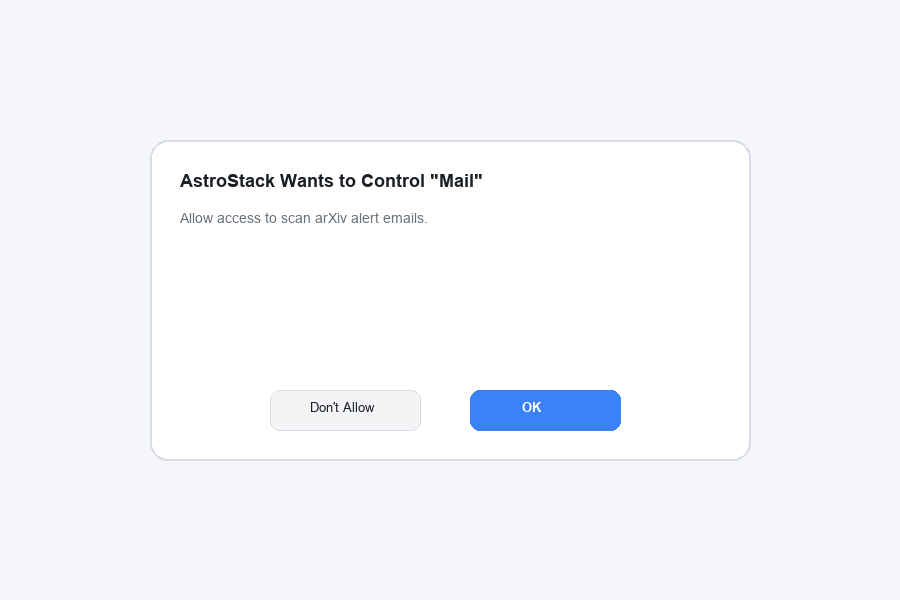
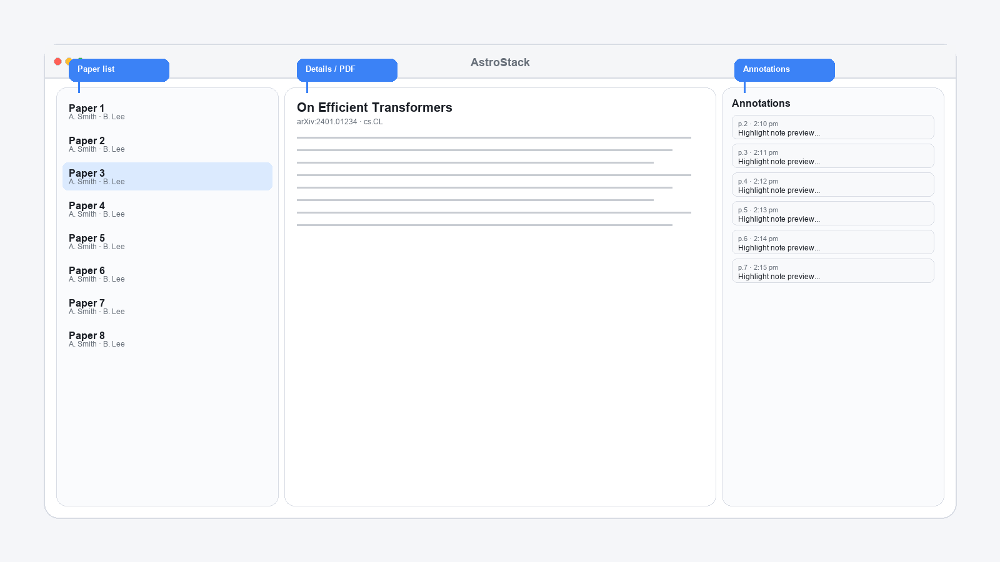
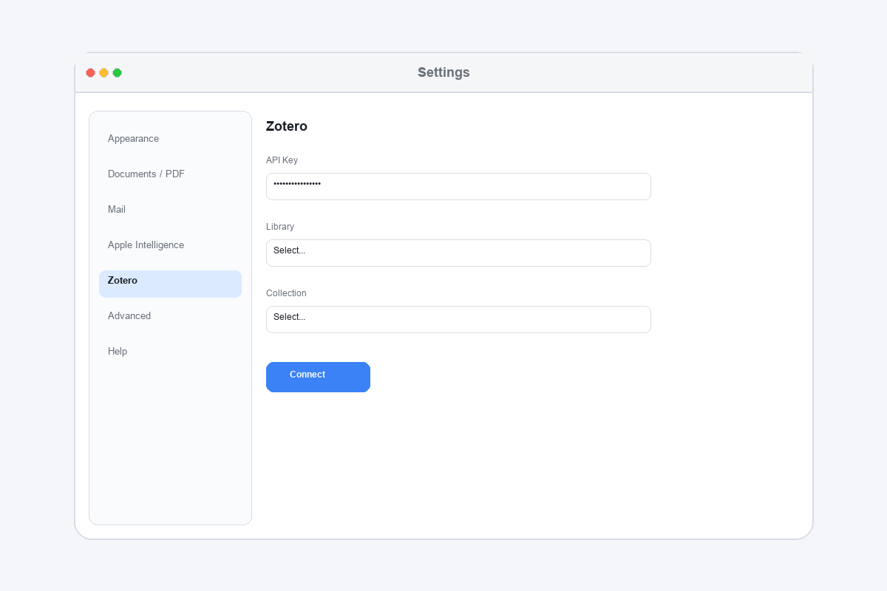
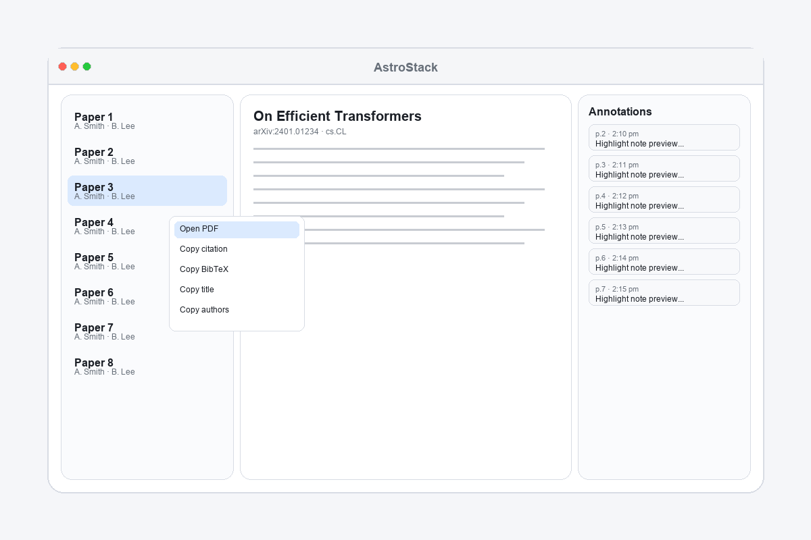
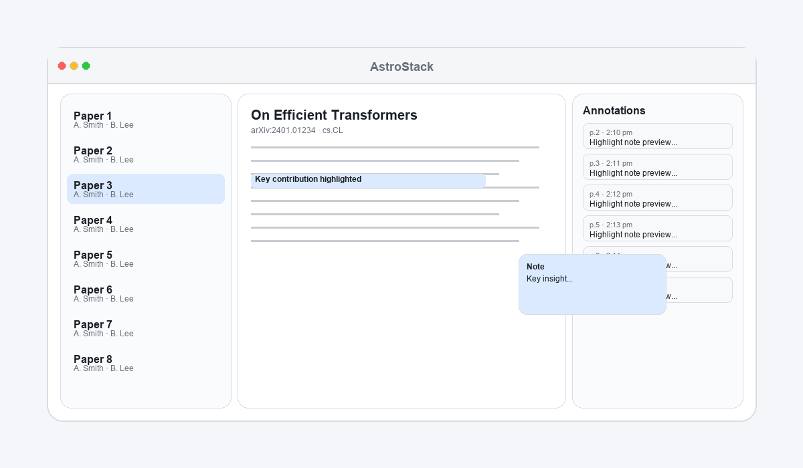
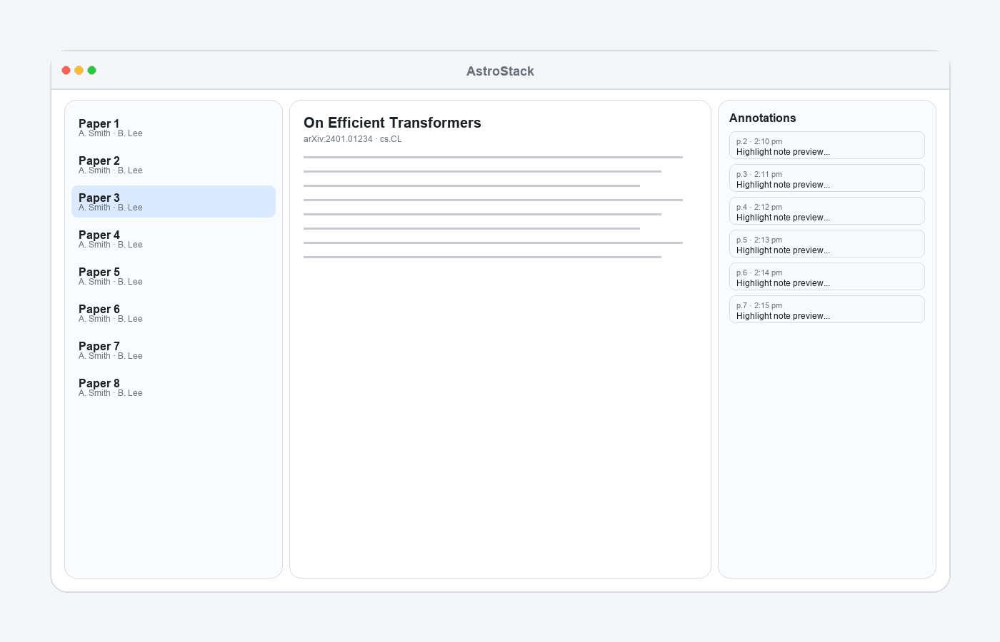
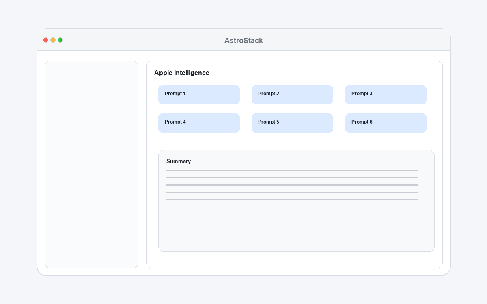

A macOS app that turns arXiv alert emails into a focused reading and annotation workspace.

  
  
  

_Caption: AstroStack combines inbox triage, PDF reading, and annotations in one workspace._

---

## At a Glance

| Area | What you get |
| --- | --- |
| Input | Scans Apple Mail arXiv alerts and builds a clean, searchable reading list |
| Reading | Built-in PDF viewer with highlights, underlines, and rich notes |
| Review | Annotations panel with page numbers, timestamps, and quick jump |
| Integrations | One-click Zotero save, email sharing, Shortcuts, Apple Intelligence |
| Storage | Local cache on your Mac; no email upload |

---

## Table of Contents

- [At a Glance](#at-a-glance)
- [Project Status](#project-status)
- [Quickstart](#quickstart)
- [Overview](#overview)
- [How It Works (High Level)](#how-it-works-high-level)
- [Features](#features)
- [Dependencies](#dependencies)
- [Installation / Download](#installation--download)
- [General Setup](#general-setup)
- [Zotero Integration](#zotero-integration)
- [Mail Features](#mail-features)
- [Core Usage Guide](#core-usage-guide)
- [Annotation System](#annotation-system)
- [Keyboard Shortcuts](#keyboard-shortcuts)
- [Advanced Features](#advanced-features)
- [Troubleshooting](#troubleshooting)
- [FAQ](#faq)
- [Contributing / Development Notes](#contributing--development-notes)
- [License](#license)
- [Credits](#credits)

---

## Project Status

> **Status**
> - Stage: Beta (private)
> - Current version: 0.1.0-beta
> - Roadmap:
>   - Public beta distribution + auto-update channel
>   - Smarter filters (semantic search + keyword suggestions)
>   - iCloud sync for notes and settings

---

## Quickstart

1. Open AstroStack and approve Mail access.
2. Wait for the initial scan to build your reading list.
3. Select a paper and press Enter to open the PDF.
4. Highlight text and add a note.
5. Save to Zotero or share by email.

_Caption: Scan Mail, review the list, open a PDF, annotate, and save._

---

## Overview

### What AstroStack is
- A macOS app that scans your arXiv alert emails, builds a clean reading list, and lets you read and annotate papers in one place.

### Who it is for
- Researchers, students, and anyone who follows arXiv and wants a faster, cleaner way to review papers.

### What problems it solves
- Too many arXiv alert emails to sort through.
- Switching between Mail, browser tabs, PDF readers, and Zotero.
- Losing track of notes and highlights.

---

## How It Works (High Level)

1. Mail scan: A small AppleScript (a built-in mac automation script) reads arXiv alert emails in Apple Mail, looks back based on your Mail scanning settings, and filters by your keyword list.
2. Local save: Paper details (title, authors, abstract, links) are saved on your Mac so the list loads quickly.
3. Viewer: Selecting a paper shows the abstract and links. Opening a PDF downloads it from arXiv and caches it.
4. Annotations: Highlights, underlines, and notes are saved into the PDF and shown in the annotations panel.
5. Integrations: Zotero uses its API (a secure connection) to save items and attach PDFs. Sharing uses your default mail app. Shortcuts and Apple Intelligence can process the current PDF.

_Caption: End-to-end flow from email ingestion to annotation and export._

---

## Features

### Key features (summary)
- Scans Apple Mail for arXiv alert emails and filters by keywords.
- A searchable reading list with quick open of abstracts and PDFs.
- Built-in PDF reading with highlights, underlines, and rich notes.
- Annotations panel that shows all notes with page numbers and timestamps.
- One-click save to Zotero (with PDF attachment).
- Share papers by email with customizable templates.
- Optional Apple Intelligence and Shortcuts tools for summaries and automation.

### Feature cards
| **Mail** Inbox -> List | **PDF** Read + Mark | **Notes** Review + Jump |
| --- | --- | --- |
| Clean, filtered arXiv alerts | Fast PDF viewing and caching | Annotations panel with timestamps |
| **Zotero** Save + Attach | **Share** Email Templates | **AI/Shortcuts** Automate |
| One-click library sync | Customizable share flows | Prompts and workflows on demand |

---

## Dependencies

### System requirements
- macOS 10.15 (Catalina) or newer

### Required tools/services
- Apple Mail (for the mail scanning feature)
- An active internet connection (to download PDFs and paper details)

### Optional integrations
- Zotero account + API key (for saving papers)
- Apple Intelligence (Apple's built-in AI features on supported Macs) for AI prompts
- Shortcuts app (built into macOS) for automation
- A mail app of your choice for sharing

---

## Installation / Download

### Option A - Use a prebuilt app (recommended)
1. Download or receive `AstroStack.app`.
2. Move it to your `Applications` folder.
3. First launch: right-click the app and choose Open to approve it.

### Option B - Build from source (advanced)
1. Install Xcode Command Line Tools:
   - Run `xcode-select --install` in Terminal.
2. Build the app:
   - Run `scripts/build-app.sh`
3. (Optional) Install to Applications:
   - Run `scripts/install-app.sh`
4. Launch:
   - Open `build/AstroStack.app` or `/Applications/AstroStack.app`

#### Common install issues
- "Xcode Command Line Tools not found"
  - Install them with `xcode-select --install`.
- "Permission denied" when copying to Applications
  - Drag the app manually, or rerun the install script with admin permission.

---

## General Setup

### First-run walkthrough
1. Open AstroStack.
2. When macOS asks for Mail access, click OK.
3. Wait while it scans Mail and builds your list.
4. Click a paper to see details; press Enter to open the PDF.

_Caption: AstroStack requests Mail access to scan arXiv alerts locally._

### Where settings live
- Open AstroStack -> Settings... (or click the gear icon).
- Tabs include Appearance, Documents / PDF, Mail, Apple Intelligence, Zotero, Advanced / Developer, and Help.
- Settings are stored by macOS for this app. You normally change them only in the Settings window.

### Initial configuration checklist
1. Mail scanning: set lookback days and keywords in Settings -> Mail -> Scanning.
2. Sharing: set your default mail app and email template in Settings -> Mail -> Sharing.
3. Zotero (optional): connect your API key in Settings -> Zotero.
4. Annotations: pick a color palette in Settings -> Documents / PDF.
5. Apple Intelligence or Shortcuts (optional): set prompts in Settings -> Apple Intelligence.
6. Apple Intelligence features (optional): download these six Apple Shortcuts first:
   1. https://www.icloud.com/shortcuts/17b47d1f926749aebbcc3a0b00eabca8
   2. https://www.icloud.com/shortcuts/028ed32e97354205aa22158c7532f5cf
   3. https://www.icloud.com/shortcuts/2bc611a377044c17ac241364c9d422a2
   4. https://www.icloud.com/shortcuts/892d18b90636422e94bc583f3c4ed885
   5. https://www.icloud.com/shortcuts/3050abb6e0124b18a136bc4203c585dc
   6. https://www.icloud.com/shortcuts/664e740fc2c240ada5c951d77d919367

### Basic navigation
- Left panel: list of papers (search + filter).
- Middle panel: details view or PDF view.
- Right panel (optional): annotations list.

_Caption: Paper list, details/PDF view, and annotations panel._

---

## Zotero Integration

### What it does
- Saves the selected paper into your Zotero library.
- Attaches the PDF (with your annotations).

### How to connect your Zotero API key
An API key is a long code that lets AstroStack talk to your Zotero account.

1. In Zotero, create an API key.
2. In AstroStack, go to Settings -> Zotero.
3. Click Connect..., paste the key, then click Save.
4. Choose your library and collection from the drop-downs.
5. (Optional) Enable Prompt for collection each time you save.

_Caption: Connect your Zotero API key and choose a library + collection._

### How to save a paper
1. Select a paper.
2. Click the Zotero button in the toolbar.
3. The button briefly animates to confirm success.
4. Click the same button again to remove the item from Zotero.

### Common issues + fixes
- "Zotero API Key Required"
  - Add your key in Settings -> Zotero.
- "Zotero Connection Failed"
  - Check that the key is correct and has access to your library.
- Library/Collection list is empty
  - Click Refresh and make sure the key has permission.

Note: Your Zotero API key is stored in your macOS Keychain.

---

## Mail Features

### How mail scanning works
- AstroStack reads arXiv alert emails in Apple Mail using AppleScript (a built-in mac automation tool).
- Lookback time and keywords are configurable in Settings -> Mail -> Scanning.
- Changes apply immediately; no restart required.

### Permissions required
- macOS Automation permission to control Apple Mail.

### Setup steps
1. Make sure arXiv alerts are arriving in Apple Mail.
2. Confirm the Mail account name matches the script:
   - Edit `Resources/MailScan.applescript`
   - Update `TARGET_ACCOUNT_NAME` (default is "Exchange")
   - Use the name you see in the Mail sidebar
3. (Optional) If your alerts come from a different sender, update `TARGET_SENDER_EMAIL`.
4. Adjust lookback days and keywords in Settings -> Mail -> Scanning.

If you installed a prebuilt app, the script lives inside the app bundle:
- Right-click `AstroStack.app` -> Show Package Contents -> `Contents/Resources/MailScan.applescript`

### Troubleshooting
- No papers found
  - Check the Mail account name.
  - Make sure arXiv alerts exist in Mail.
  - Loosen keywords in Settings -> Mail -> Scanning.
- "Mail not authorized"
  - Go to System Settings -> Privacy & Security -> Automation.
  - Enable Mail access for AstroStack.

### Privacy explanation
> **Privacy**
> - Mail scanning happens locally on your Mac.
> - AstroStack does not upload your emails.
> - Network calls only happen when:
>   - Downloading PDFs from arXiv
>   - Saving to Zotero
>   - Running Apple Intelligence or Shortcuts (if enabled)

---

## Core Usage Guide

### Opening papers
1. Click a paper in the list to see details.
2. Press Enter to open the PDF.
3. Double-click a paper to open the arXiv abstract in your browser.

### Navigating publications
- Use the search bar to filter results.
- Use Up/Down arrow keys to move through the list.
- Right-click a paper for quick actions:
  - Open PDF
  - Copy citation
  - Copy BibTeX link
  - Copy title or authors

_Caption: Right-click actions for quick open and copy operations._

### Creating and editing annotations
1. Open a PDF.
2. Select text.
3. Choose Highlight or Underline.
4. Pick a color and add a note.
5. Click outside the box to save.

_Caption: Add a highlight and attach a short note._

### Using the annotations panel
1. Click the Annotations button in the toolbar.
2. The right panel shows all highlights and notes.
3. Click a row to jump to that spot in the PDF.
4. Use the row menu to edit, recolor, or delete.

_Caption: Review notes with page numbers and timestamps._

### Saving / exporting
- Auto-save: annotations are saved automatically in the cached PDF.
- Export to Zotero: use the Zotero button to save and attach the annotated PDF.
- Share by email: use the Share button to send a paper link with a template.

---

## Annotation System

### Highlights vs underlines
- Highlight: colored background for important passages.
- Underline: a clean line under the text.
- You can convert between them later.

### Tags / colors
- Choose from several color palettes.
- Customize palettes in Settings -> Documents / PDF.
- Existing annotations keep their color; new ones use the current palette.

### Formatting tools
- Bold, italic, and underline
- Bulleted and numbered lists
- Rich text in notes

### List features
- The annotations panel groups and lists notes by page.
- Each entry shows a short preview and the page label.

### Date/time metadata
- Each annotation shows the date and time it was created.

### Editing tips
- Click any annotation in the list to jump to it.
- Use the list menu to change color or delete.
- Keep notes short. Short notes are easier to scan.

---

## Keyboard Shortcuts

| Action | Shortcut |
| --- | --- |
| Move selection up/down | Up/Down arrows |
| Open selected paper PDF | Enter |
| Find in PDF | Cmd + F |
| Zoom in | Cmd + + |
| Zoom out | Cmd + - |
| Reset zoom | Cmd + 0 |
| Return from PDF to details | Esc |
| Close AstroStack window (for Shortcuts handoff) | Cmd + Shift + E |

---

## Advanced Features

Show advanced features

### AI tools (Apple Intelligence)
- Six prompt buttons can summarize or analyze the current paper.
- Customize prompts in Settings -> Apple Intelligence.
- Results appear in a panel; you can add them to annotations.

> **Apple Intelligence note**
> If Apple Intelligence is not available on your Mac, use Shortcuts instead.

_Caption: Trigger AI prompts and review results in a side panel._

### Automation (Shortcuts)
A Shortcut is a small automation you make in Apple's Shortcuts app.

- You can run a Shortcut on the current PDF.
- Set Shortcut names in Settings -> Apple Intelligence (for the prompt buttons).
- The Share button can also run a Shortcut (Settings -> Mail -> Sharing).
- The app can pass:
  - The current PDF (annotated)
  - The paper link (optional)

### Bulk workflows
- Use search + keyboard navigation to review many papers quickly.
- Right-click for fast copy actions (citation, BibTeX, title, authors).
- Save multiple papers to Zotero in a row with one-click saves.

### Power-user tips
- Tune keywords in Settings -> Mail -> Scanning to refine your feed.
- Disable background refresh by setting `ASTROSTACK_DISABLE_LAUNCH_AGENT=1` (this turns off the small background task that checks for new mail).
- Clear cached PDFs if storage is low: `~/Library/Caches/AstroStack/appCache/pdfs`.

---

## Troubleshooting

Show troubleshooting

### Common problems
- No papers appear
  1. Confirm arXiv alerts exist in Apple Mail.
  2. Check `TARGET_ACCOUNT_NAME` in `Resources/MailScan.applescript`.
  3. Reduce keyword strictness in Settings -> Mail -> Scanning.
- Mail scan fails or times out
  1. Open Mail and leave it running.
  2. Try again after Mail finishes syncing.
- PDF will not open
  1. Check your internet connection.
  2. Right-click the paper and open the arXiv page in a browser.
- Zotero save fails
  1. Re-check your API key in Settings -> Zotero.
  2. Refresh the library/collection list.
  3. Make sure the PDF is open.
- Shortcuts or AI tools do not run
  1. Confirm the Shortcut name matches exactly.
  2. Make sure Apple Intelligence is enabled (if using it).
  3. Try a simple Shortcut first to test.
- Need to report a bug
  1. Open Settings -> Help.
  2. Click Report Bugs and follow the on-screen steps.

---

## FAQ

**Q: Do I need a Zotero account?**
A: No. Zotero is optional.

**Q: Does AstroStack upload my emails?**
A: No. Mail scanning is local and does not upload your email content.

**Q: Where are my notes stored?**
A: They are saved inside the cached PDF and shown in the annotations panel.

**Q: Can I change the keywords it uses?**
A: Yes. Update keywords in Settings -> Mail -> Scanning.

**Q: How do I stop background refresh?**
A: Set `ASTROSTACK_DISABLE_LAUNCH_AGENT=1` or remove `~/Library/LaunchAgents/com.juliomorales.AstroStack.refresh.plist` (this file controls the background refresh task).

---

## Contributing / Development Notes

### Project structure
- `Sources/` - Swift source code
- `Resources/` - Assets and `MailScan.applescript`
- `scripts/` - Build and install scripts
- `build/` - App output
- `tests/` - Automated tests

### Safe modification tips
- Default mail scan keywords/lookback live in `Sources/ArxivPicker/PickerWindowController.swift` (AppSettingsDefaults).
- Rebuild with `scripts/build-app.sh` after code changes.
- Use `scripts/install-app.sh` to update the app in `/Applications`.

---

## License

Copyright (c) 2026 Julio Morales. All rights reserved.

---

## Credits

- Product, design, and engineering: Julio Morales
- Data sources and integrations: arXiv, Zotero
